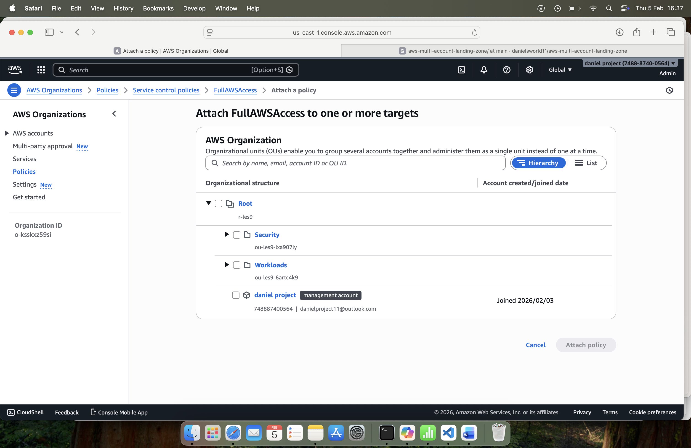
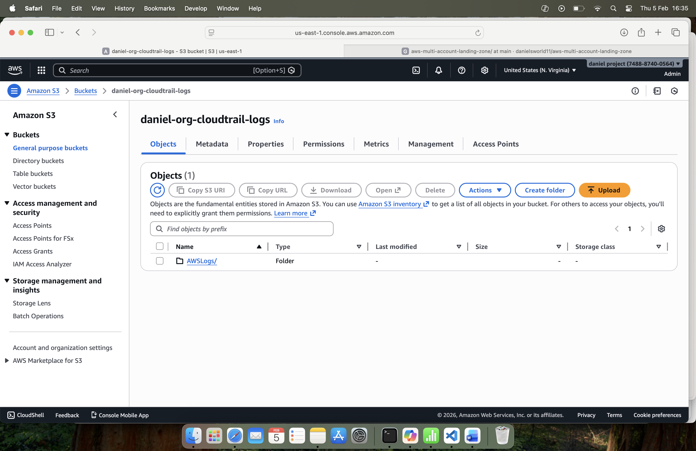
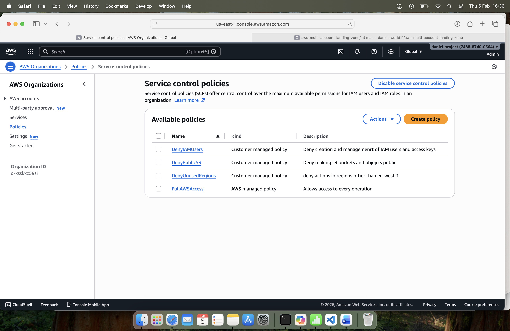
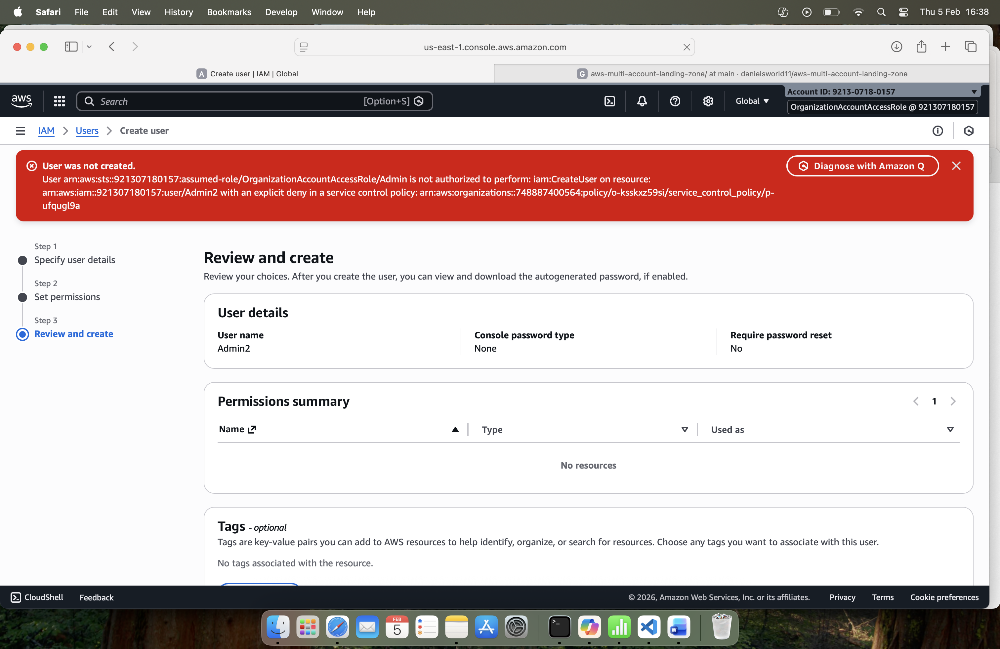

This project implements a real-world AWS multi-account landing zone following enterprise platform engineering best practices. 
Week 1 focuses on building the foundational goverance layer using AWS organizations, CloudTrail, and Service Control Policies (SCPs).

AWS Organization Layout
Root
├── Security OU
│   └── Security Account
├── Workloads OU
│   ├── Dev Account
│   ├── Prod Account
│   └── Shared Services Account
└── Management Account

Management Controls the entire AWS Organization, billing, and governance. 
Security Centralized security tooling, logging, monitoring, and threat detection.       
Shared Services CI/CD, networking, directory services, and shared infrastructure.      
Dev Safe environment for development and testing.  
Prod Isolated, tightly controlled production environment.   

Organization‑Wide CloudTrail
mplementation

A single organization‑wide CloudTrail named org-trail was created from the Management account.

Key configuration:

• Applied to all accounts in the organization
• Logs stored in central S3 bucket: daniel-org-cloudtrail-logs
• Management events: Read/Write
• Data events: optional (S3 enabled later)

Benefits

• Ensures consistent audit logging
• Prevents gaps in monitoring
• Supports security investigations
• Centralizes logs for analysis in the Security account

Service Control Policies (SCPs)

Three SCPs were created and attached to the Workloads OU.

SCP: DenyPublicS3

Purpose: Prevent public S3 buckets and objects.
Risk Mitigated: Accidental data exposure.
Trade‑off: Public hosting requires explicit exceptions.

SCP: DenyIAMUsers

Purpose: Block IAM user creation and enforce role‑based access.
Risk Mitigated: Long‑lived access keys, inconsistent identity management.
Trade‑off: Requires IAM Identity Center or federation later.

SCP: DenyUnusedRegions

Purpose: Restrict workloads to a single approved region (eu-west-1).
Risk Mitigated: Attackers using hidden regions, cost leakage, data residency issues.
Trade‑off: Multi‑region architectures require SCP updates.

Account Validation

Each member account was accessed using:

Role: OrganizationAccountAccessRole

Validation steps performed:

Test    Expected        Result 
Create IAM user Denied  ✔ AccessDenied 
Make S3 bucket public   Denied  ✔ AccessDenied 
Launch resource in blocked region       Denied  ✔ AccessDenied 
View CloudTrail Read‑only       ✔ Visible      
Basic console access    Allowed ✔ Works

This confirms SCPs and CloudTrail are functioning correctly.

Security Account Documentation

Access Verification

Successfully switched into the Security account using OrganizationAccountAccessRole, confirming cross‑account access is configured correctly.

Purpose

The Security account will host:

• GuardDuty
• Security Hub
• IAM Access Analyzer
• Centralized log analysis
• Cross‑account monitoring roles

CloudTrail Visibility

The organization‑wide CloudTrail is visible in read‑only mode, confirming correct propagation.

SCP Inheritance

The Security account inherits policies from the Security OU.
Workload SCPs do not apply here, ensuring full security tooling functionality.

---

Why Multi‑Account Architecture

Problems With a Single Account

• Dev and Prod share the same blast radius
• Hard to enforce governance
• Difficult cost separation
• Security tooling mixed with workloads
• Higher risk of accidental production impact

Benefits of Multi‑Account

• Strong isolation between environments
• Clear ownership and responsibility boundaries
• Centralized governance via SCPs
• Improved security posture
• Better cost visibility
• Scalable for future teams and workloads

Alignment With AWS Best Practices

This structure aligns with:

• AWS Well‑Architected Framework
• AWS Landing Zone patterns
• Enterprise governance models

Screenshots
## Screenshots

---

 Week 1 Summary

By the end of Week 1, the following were completed:

• Multi‑account AWS Organization created
• Security and Workloads OUs configured
• Organization‑wide CloudTrail enabled
• SCP guardrails implemented
• Cross‑account access validated
• Documentation prepared for portfolio use

This establishes a secure, scalable foundation for the rest of the landing zone.

